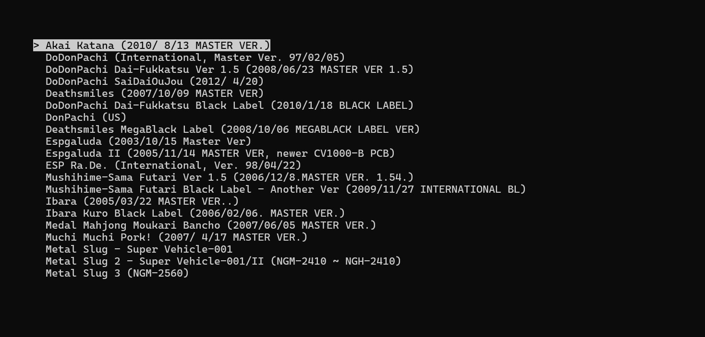

# Simple MAME Frontend
This frontend is just a list of your roms. Pick a game and play!
<br>
<br>
This guide is tailored for GroovyArcade (which uses GroovyMAME) so remember to adjust resolution to your liking under `sudo gasetup`. 
<br>
You can of course use this frontend with any other version of Mame.
<br>
<br>
This frontend is looking at your roms under `/home/arcade/shared/roms/mame` and displaying them in a list. You can control the number of visible games and the left padding of the list. This is to make sure you have some control to position the list where you want it. How you change these parameters is explained down below.
<br>
<br>
Along with the frontend script there's also a `rom_titles.txt` file that contains every rom out there with the correct title. The script looks into this .txt file and changes the `<romname>` to it's proper title in the frontend. This will make `akatana.zip` look like `Akai Katana` for example. 
<br>
<br>
Press `up/down` to pick a game.
<br>
Press `left/right` to go the next/previous character. 
<br>
Press `esc` to `Shutdown` or `Exit to shell`.
<br>
<br>
**DISCLAIMER!**
<br>
I'm not a programmer. This python script was made using ChatGPT, therefore I don't know the in's and out's of this code but it works!
<br>
<br>
 
<br>
<br>
Install `git` if you haven't already:
```
 sudo pacman -Sy git
```
Download frontend.
```
cd /home/arcade/
sudo git clone https://github.com/fixongbg/simple_mame_frontend.git
sudo chmod 777 /home/arcade/simple_mame_frontend/smf.py
sudo chmod 777 /home/arcade/rom_titles.txt
```
Disable default frontend in GroovyArcade.
```
sudo nano /home/arcade/shared/configs/ga.conf
```
Comment out `frontend`
```
##frontend=attractplus
video.backend=KMS
monitor=generic_15
kernel_video_cmdline=monitor=generic_15 video=VGA-1:640x480iS
connector=VGA-1
```
Disable autostart scripts.
```
sudo nano /home/arcade/.bash_profile
```
Comment out `sudo gasetup` and `/opt/gasetup/login.sh` and add path to the new frontend `smf.py` at the bottom.
```
#!/bin/bash

if [[ $(tty) == /dev/tty1 ]] ; then
    sudo setterm --powerdown 0 --blank 0
    /opt/galauncher/startfe.sh
##  sudo gasetup
##  /opt/gasetup/login.sh
    python /home/arcade/simple_mame_frontend/smf.py
fi
```
Edit frontend script parameters (if needed).
```
sudo nano /home/arcade/simple_mame_frontend/smf.py
```
Change paths and parameters to your liking.
```
# Path to your MAME executable and ROMs directory
MAME_CMD = "/usr/lib/mame/groovymame"
ROMS_DIR = "/home/arcade/shared/roms/mame"

# Number of visible items in the list
VISIBLE_ITEMS = 16

# # Adjust this to control the left position of the list.
PADDING = 1
```
Clean up.
```
sudo rm /home/arcade/simple_mame_frontend/screenshot.jpg
sudo rm /home/arcade/simple_mame_frontend/README.md
```
